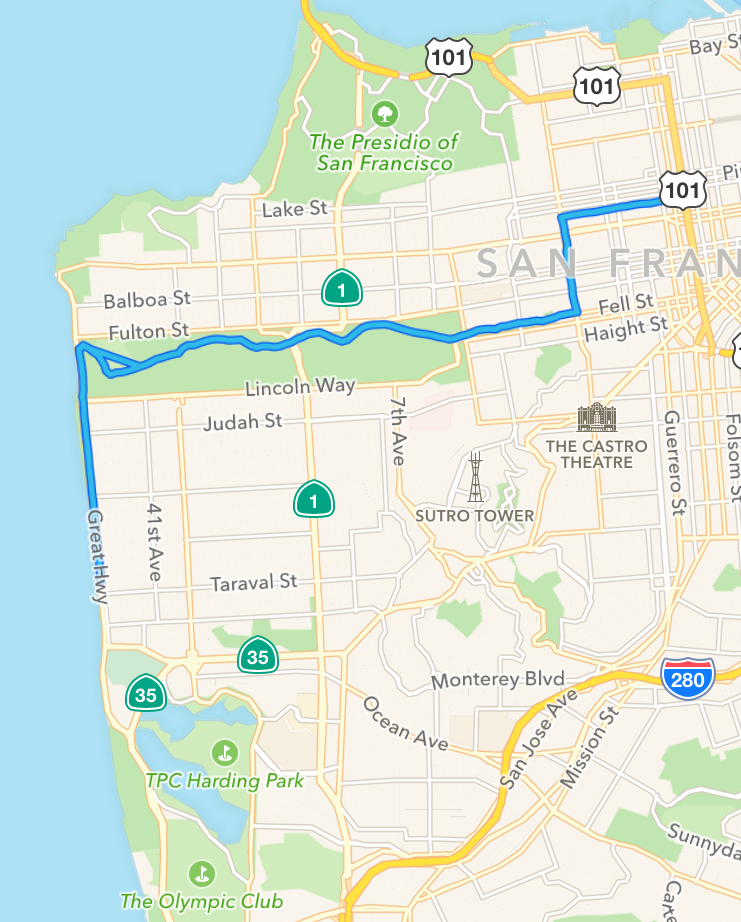

# Uncertainty in Running Measurement

### Read Time: 2 mins

### Intro
My friend Scott and I went on a run through Golden Gate Park in training for a Marathon and a Half Marathon respectively.  The question every marathoner in training wants to know is: what's my time going to be?  Well in order to answer this question, first we need to know your current time.

This got me wondering, how good is Strava at telling me my pace?  With no official stats on the uncertainty in these apps and my BA in Physics, I set out to run an experiment.

### Methodology

*Disclaimer before we start: this is going to be science like Mythbusters does science, not like a scientist.  A better experiment would have be for me to run with both phones.*

Scott and I ran the exact same route at the exact same pace.  We both used the auto-pause feature on our respective apps.  I used [Strava](https://www.strava.com/) and carried my phone in my hand and Scott used [Nike+](http://www.nike.com/us/en_us/c/running/nikeplus/gps-app) and had his phone in an armband.  I can't say that we were perfectly in step the entire way, but never more than 2 steps off the entire 10 miles.

#### Route

​

**Our route through GGP and along Ocean Beach**

You can check out the calc.py file for how I calculated the results in detail.  For the uncertainty in a single mile, I used the difference between my time and Scott's.  The actual times should be nearly identical but there should be slight variations due to the auto-pause feature.  To propagate uncertainty, we assume the errors are IID giving the uncertainty in total time and average pace as below:
```python
time_unc = sqrt(sum([unc ** 2 for unc in mile_unc]))
pace_unc = time_unc / sqrt(num_miles)
```

Normally we would need to use relative uncertainties but because these are all time measurements and all the times are within 10% of each other, the difference is negligible.

### Results
The 10 mile run took us 1:20:46 &plusmn; 14s.  We averaged a 8:04 &plusmn; 4s pace.  There is a 95% chance our pace was betweem 8:12 and 7:55 per mile.

#### Paces with Uncertainty
​

**Mile times for each mile and the average pace.  The error bars indicate the uncertainty.**

Its interesting that the uncertainties are relatively larger in mile 1.  My guess is that this has to do with the auto-pause feature on the apps.  The first mile has about 5 times the number of stop lights when compared with the other miles so we were stopping frequently.  Also, on the city streets there is a lot more interference from pedestrians potentially causing momentary pace disruptions.  However mile 2 still has stoplights and our times came out the same.  After mile 2, there are only a few lights in miles 3 and 8-10 (when we get to ocean beach.)


BTW, [this projects](http://www.runnersworld.co.uk/general/rws-race-time-predictor/1681.html) my half marathon at somewhere between 1:47:13 and 1:47:50 so my Strava uncertainty certainly won't be the deciding factor in whether or not I hit my goal of 1:45.

### Next steps
Next time Scott and I go out, I want to try holding both phones to see how this compares.  I also want to try us both on the same app.  After a few more rounds we should have a more accurate view of uncertainty.  The only issue is collecting data is exhausting!
