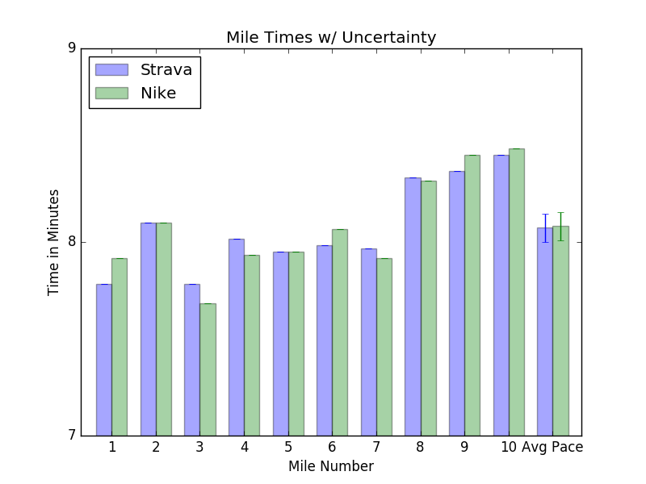

# Uncertainty in Running Measurement

### Read Time: 2 mins

### Intro
My friend Scott and I went on a run through Golden Gate Park in training for a Marathon and a Half Marathon respectively.  The question every marathoner in training wants to know is: what's my time going to be?  Well in order to answer this question, first we need to know your current time.

This got me wondering, how good is Strava at telling me my pace?  With no official stats on the uncertainty in these apps and my BA in Physics, I set out to run an experiment.

### Methodology

Disclaimer before we start: this is going to be science like Mythbusters does science, not like a scientist.

Scott and I ran the exact same route at the exact same pace.  We both used the auto-pause feature on our respective apps.  I used [Strava](https://www.strava.com/) and carried my phone in my hand and Scott used [Nike+](http://www.nike.com/us/en_us/c/running/nikeplus/gps-app) and had his phone in an armband.  I can't say that we were perfectly in step the entire way, but never more than 2 steps off the entire 10 miles.

#### Route

​

**Our route through GGP and along Ocean Beach**

You can check out the code for how I calculated the results.  I used the basic IID formula for aggregating uncertainties and estimated 1-sigma uncertainty as the difference in our pace.

### Results
The 10 mile run took us 1:20:46 &plusmn; 14s.  We averaged a 8:04 &plusmn; 4s pace.  There is a 95% chance our pace was betwee 8:12 and 7:55 per mile.

#### Paces with Uncertainty
​

**Mile times for each mile and the average pace.  The error bars indicate the uncertainty**

Its interesting that the uncertainties are relatively larger in mile 1.  My guess is that this has to do with the auto-pause feature on the apps.  The first mile has about 5 times the number of stop lights when compared with the other miles.  However mile 2 still has stoplights and our times came out the same.  

These uncertainties are also generous calculations, it is likely that the times are much closer to the measured values, but as a statistician, that wasn't good enough for me!

BTW, [this projects](http://www.runnersworld.co.uk/general/rws-race-time-predictor/1681.html) my half marathon at somewhere between 1:47:13 and 1:47:50 so my Strava uncertainty certainly won't be the deciding factor in whether or not I hit my goal of 1:45.
